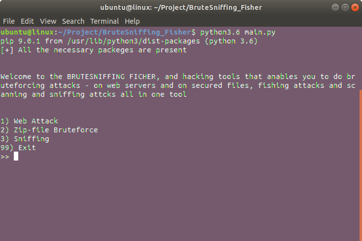
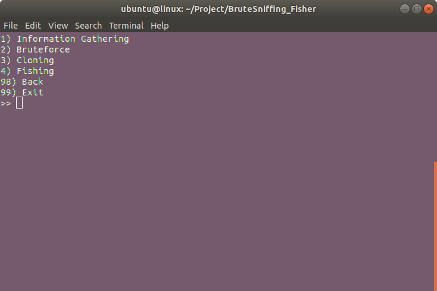

# BruteSniffing fisher

## Introduction
Welcome to the ButeSniffing_Ficher, a multiplatform python hacking tool in a menu style. 

Launch the program by the command line by 
*
  * _python main.py_
   
It allows you do to:
* Sniffing
* Zip-file Bruteforce
* Website attacks
    * Information gathering
    * Web Server Bruteforcing
    * Cloning
    * Fishing

## Python version
The program has been developed using python3.6. However no issue should occur with older 3. versions.
You can select from the compatible versions in the Setup/setup.py file by uncommenting the line corresponding to the version you choose (and by commenting the other versions).

## Requirements
Automatically checks for the presence of the required libraries and installs them if you consent it. If you don't consent it, it shows you the command to perform to install the libraries.\\
Libraries required:
* requests
* urllib3
* BeautifulSoup
* ctypes
* netaddr
* python-nmap

## Structure
Hirerchy of the project:
* main.py
* Setup
    * setup.py - sets the python version,the menus to show, the unix-windows commands generalisation and Proxychains and Tor settings
    * check.py - checks on the required libraries and on the pip installation
    * server.config - constant to set if using localhost (choose between MAMP , XAMPP aphache servers and apache2 server)
* Includes
    * includes.py - some functions used by the modules
* modules - objects for the the controller (navigator between menus) and the attacks
* data - initially empty, where the cloned pages and the found credentials are stored
* Server - code to put in the index.php file on the server for the fishing

You can add more attack options by updating the menus and the link between menus in the Setup/setup.py and the modules in the modules directory

## Proxychains and Tor
Proxychains and Tor are supported for Linux platforms. Edit the settings in the Setup/setup.py file

## Screenshots

## Issues and Improvements
* Functionalities can be added adding 'menus' in the Setup.setup.py file, modules in the modules directories and functions in the Includes.includes.py file.
* The server settings may be improved, the goal would be to make the fishing attack available using the default web server of a system
* In the fishing attack the python program waits for a temp.txt file to be created by the php code, then deleted it. The process has to be slowed down for the python program to grab the tmp.txt file.

## References
Reference for the web page bruteforcing: https://github.com/IAmBlackHacker/Facebook-BruteForce
